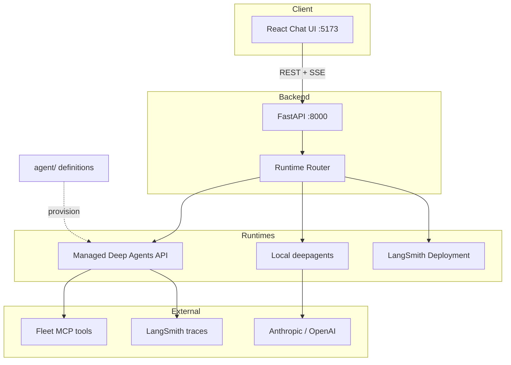

# Managed Deep Agents — End-to-End Research Assistant

A full-stack chat application built on [LangChain Managed Deep Agents](https://docs.langchain.com/langsmith/deploy-managed-deep-agent), with **human-in-the-loop** tool approval, **multi-runtime** support, and **Docker Compose** for one-command startup.

## Architecture

Open the interactive diagram: `canvases/langch-architecture.canvas.tsx` (Canvas beside chat).



| Layer | Role |
| --- | --- |
| `agent/` | Instructions, tools, skills, subagents (version-controlled) |
| `backend/` | Runtime abstraction + SSE streaming + HITL resolve/resume |
| `frontend/` | Chat UI, interrupt approval modal, markdown rendering |
| `langgraph.json` | Deploy graph to LangSmith via `langgraph up` |

## Runtime modes (`AGENT_RUNTIME`)

| Mode | When | Requirements |
| --- | --- | --- |
| `auto` (default) | Picks best available | See priority below |
| `managed` | Production on LangSmith | `LANGSMITH_API_KEY`, `MANAGED_AGENT_ID` |
| `local` | Dev without preview access | `ANTHROPIC_API_KEY` or `OPENAI_API_KEY` |
| `deployment` | Self-hosted Agent Server | `LANGGRAPH_DEPLOYMENT_URL`, `LANGGRAPH_ASSISTANT_ID` |

**Auto priority:** `deployment` URL → `managed` → `local`.

## Features

- **Managed Deep Agents** — create agent, threads, streamed runs via `/v1/deepagents`
- **Human-in-the-loop** — web search requires approval (`REQUIRE_HITL_APPROVAL=true`); UI modal + `resolve-interrupt` + `resume-stream`
- **Local fallback** — open-source `deepagents` with in-memory checkpoints (stub web search)
- **LangSmith Deployment** — `langgraph.json` + `backend/agent.py` for `langgraph up`
- **Docker Compose** — `make docker-up` → frontend on :3000, backend on :8000

## Quick start

### 1. Configure

```bash
cp .env.example .env
# Set LANGSMITH_API_KEY (+ provider keys for local mode)
```

### 2. Install

```bash
make install
```

### 3. Provision (managed mode)

```bash
make provision
```

### 4. Run locally

```bash
make backend    # terminal 1
make frontend   # terminal 2  → http://localhost:5173
```

### Or: Docker

```bash
make docker-up   # http://localhost:3000
```

## Human-in-the-loop

`agent/tools.json` enables interrupts for `tavily_web_search`. When the agent calls that tool:

1. Stream emits an `interrupt` SSE event
2. UI shows **Approve / Reject**
3. `POST /api/chat/resolve-interrupt` completes the pause
4. `POST /api/chat/resume-stream` continues token streaming

Toggle at provision time:

```bash
REQUIRE_HITL_APPROVAL=false make provision
```

## LangSmith Deployment

Deploy the same graph defined in `backend/agent.py`:

```bash
pip install langgraph-cli
langgraph up
# Set LANGGRAPH_DEPLOYMENT_URL and LANGGRAPH_ASSISTANT_ID in .env
# AGENT_RUNTIME=deployment
```

## API endpoints

| Method | Path | Description |
| --- | --- | --- |
| GET | `/api/health` | Runtime mode + readiness |
| POST | `/api/conversations` | Create thread |
| POST | `/api/chat/stream` | Send message (SSE) |
| POST | `/api/chat/resolve-interrupt` | Approve/reject tool call |
| POST | `/api/chat/resume-stream` | Continue after approval (SSE) |

## Project layout

```
langch/
├── agent/                  # Deep Agent definition
├── backend/
│   ├── app/runtime/        # managed | local | deployment
│   ├── agent.py              # LangGraph deploy entry
│   └── scripts/provision_agent.py
├── frontend/
├── langgraph.json
├── docker-compose.yml
└── Makefile
```

## Documentation

- [Managed Deep Agents](https://docs.langchain.com/langsmith/deploy-managed-deep-agent)
- [API reference](https://docs.langchain.com/langsmith/managed-deep-agents-api)
- [Deep Agents SDK](https://docs.langchain.com/oss/python/deepagents/overview)
- [LangSmith Deployment](https://docs.langchain.com/langsmith/deployment-quickstart)
# langchain-echosystem
